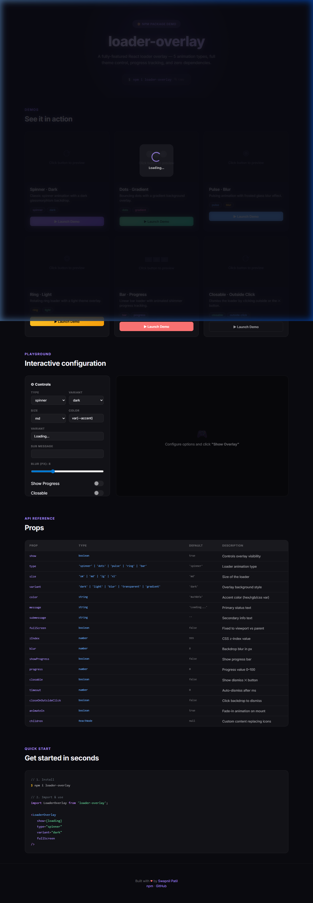

# 🎨 LoaderOverlay Demo



Interactive demo app showcasing the [loader-overlay](https://www.npmjs.com/package/loader-overlay) React component.

> A fully-featured React loader overlay — 5 animation types, full theme control, progress tracking, and **zero dependencies**.

## ✨ Features Demonstrated

- **5 Animation Types** — Spinner, Dots, Pulse, Ring, and Bar
- **5 Overlay Variants** — Dark, Light, Blur, Transparent, and Gradient
- **Progress Tracking** — Animated shimmer progress bar
- **Closable Overlays** — Dismiss via ✕ button or outside clickgit 
- **Interactive Playground** — Configure every prop in real-time
- **API Reference** — Full props table with types and defaults

## 🚀 Getting Started

### Prerequisites

- [Node.js](https://nodejs.org/) (v16 or later)
- npm (v7 or later)

### Installation

```bash
# Clone the repository
git clone https://github.com/swapnilhpatil/demo-loader-overlay.git
cd demo-loader-overlay

# Install dependencies
npm install
```

### Development

```bash
npm run dev
```

Opens the app at [http://localhost:5173](http://localhost:5173).

### Production Build

```bash
npm run build
npm run preview
```

## 📦 Quick Start with `loader-overlay`

```bash
npm i loader-overlay
```

```jsx
import LoaderOverlay from 'loader-overlay';

<LoaderOverlay
  show={loading}
  type="spinner"
  variant="dark"
  fullScreen
/>
```

## 🎛️ Available Props

| Prop | Type | Default | Description |
| --- | --- | --- | --- |
| `show` | `boolean` | `true` | Controls overlay visibility |
| `type` | `'spinner' \| 'dots' \| 'pulse' \| 'ring' \| 'bar'` | `'spinner'` | Loader animation type |
| `size` | `'sm' \| 'md' \| 'lg' \| 'xl'` | `'md'` | Size of the loader |
| `variant` | `'dark' \| 'light' \| 'blur' \| 'transparent' \| 'gradient'` | `'dark'` | Overlay background style |
| `color` | `string` | `'#a78bfa'` | Accent color (hex/rgb/css var) |
| `message` | `string` | `'Loading...'` | Primary status text |
| `submessage` | `string` | `''` | Secondary info text |
| `fullScreen` | `boolean` | `false` | Fixed to viewport vs parent |
| `blur` | `number` | `8` | Backdrop blur in px |
| `showProgress` | `boolean` | `false` | Show progress bar |
| `progress` | `number` | `0` | Progress value 0–100 |
| `closable` | `boolean` | `false` | Show dismiss ✕ button |
| `timeout` | `number` | `0` | Auto-dismiss after ms |
| `closeOnOutsideClick` | `boolean` | `false` | Click backdrop to dismiss |
| `animateIn` | `boolean` | `true` | Fade-in animation on mount |
| `children` | `ReactNode` | `null` | Custom content replacing icons |

## 🛠️ Tech Stack

- **React 18** — UI library
- **Vite 5** — Build tool & dev server
- **loader-overlay** — The component being demonstrated

## 👤 Author

**Swapnil Patil** — [GitHub](https://github.com/swapnilhpatil)

## 📄 License

This project is open source and available under the [MIT License](LICENSE).
