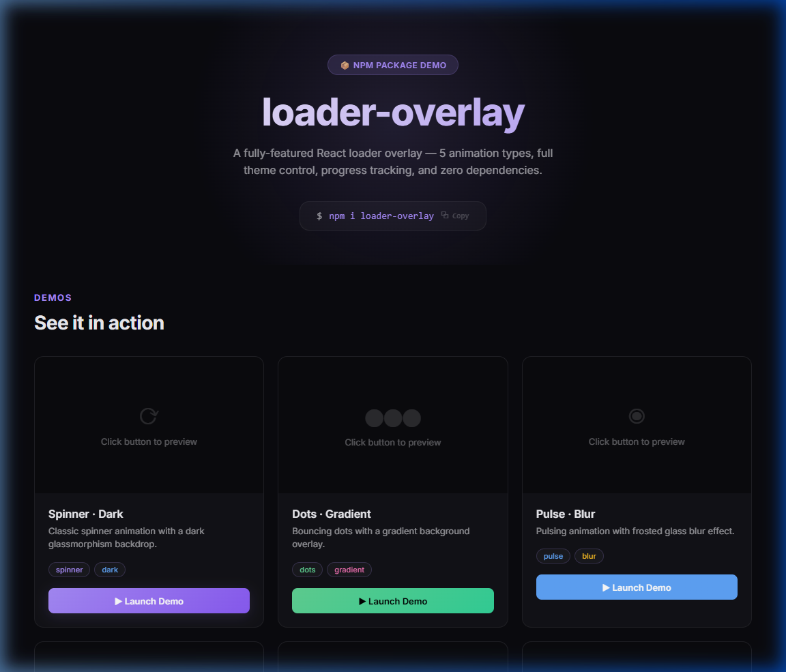
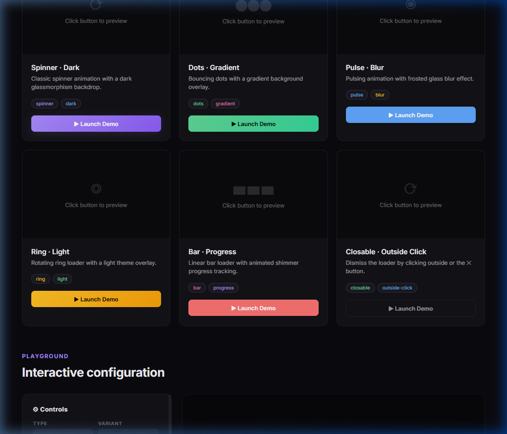
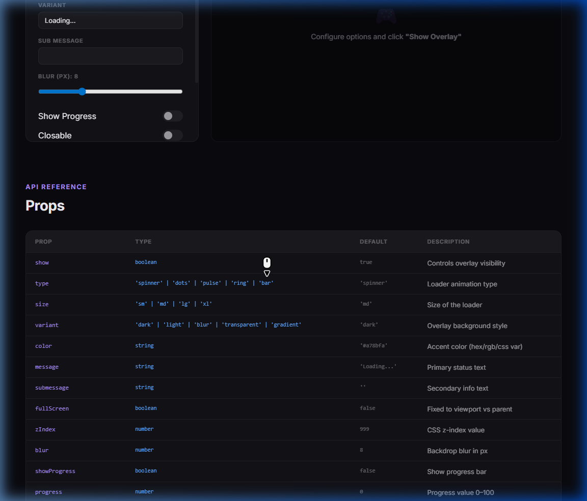
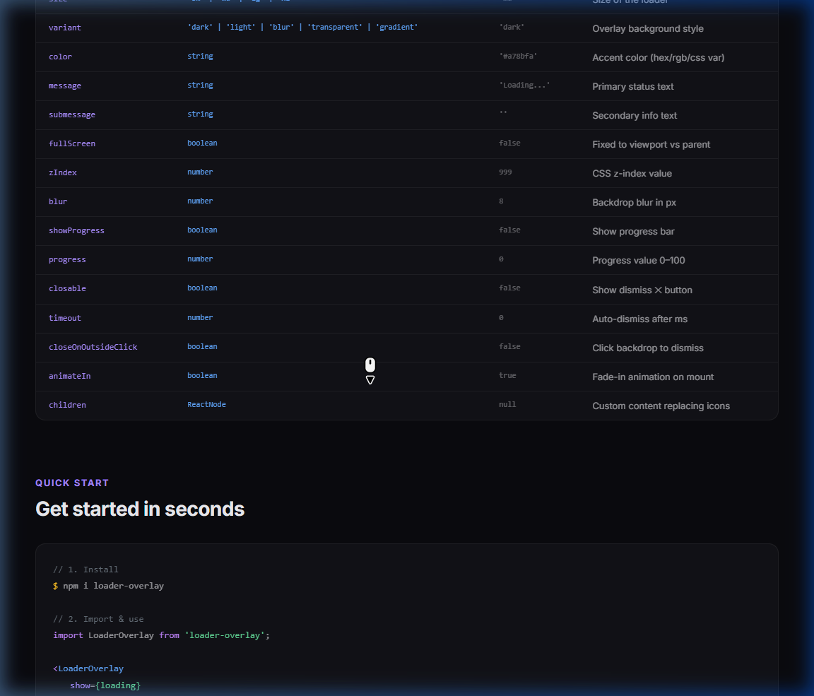

# 🎨 LoaderOverlay Demo

[](https://demo-loader-overlay.vercel.app/)

**Live Demo:** [LoaderOverlay Demo](https://demo-loader-overlay.vercel.app/)



Interactive demo app showcasing the [loader-overlay](https://www.npmjs.com/package/loader-overlay) React component.

> A fully-featured React loader overlay — 5 animation types, full theme control, progress tracking, and **zero dependencies**.

## ✨ Features Demonstrated

- **5 Animation Types** — Spinner, Dots, Pulse, Ring, and Bar.
- **5 Overlay Variants** — Dark, Light, Blur, Transparent, and Gradient.
- **Progress Tracking** — Animated shimmer progress bar for long-running tasks.
- **Flexible Dismissal** — Dismiss via ✕ button, outside click, or automatic timeout.
- **Interactive Playground** — Configure every prop in real-time to see visual changes.
- **Full Customization** — Control colors, sizes, blur intensity, and more.
- **Custom Content** — Replace default icons with any React element using `children`.

## 📸 Visual Tour

### Demos


### Interactive Playground


### Comprehensive API Reference


## 🚀 Getting Started

### Installation

```bash
# Clone the repository
git clone https://github.com/swapnilhpatil/demo-loader-overlay.git
cd demo-loader-overlay

# Install dependencies
npm install
```

### Development

```bash
npm run dev
```

Opens the app at [http://localhost:5173](http://localhost:5173).

## 📦 Using `loader-overlay` in your project

```bash
npm i loader-overlay
```

```jsx
import LoaderOverlay from 'loader-overlay';

function App() {
  const [loading, setLoading] = useState(true);

  return (
    <LoaderOverlay
      show={loading}
      type="spinner"
      variant="blur"
      message="Processing..."
      fullScreen
    />
  );
}
```

## 🎛️ Complete API Reference

| Prop | Type | Default | Description |
| :--- | :--- | :--- | :--- |
| `show` | `boolean` | `true` | Controls overlay visibility |
| `type` | `'spinner' \| 'dots' \| 'pulse' \| 'ring' \| 'bar'` | `'spinner'` | Loader animation type |
| `size` | `'sm' \| 'md' \| 'lg' \| 'xl'` | `'md'` | Size of the loader |
| `variant` | `'dark' \| 'light' \| 'blur' \| 'transparent' \| 'gradient'` | `'dark'` | Overlay background style |
| `color` | `string` | `'#a78bfa'` | Accent color (hex/rgb/css var) |
| `message` | `string` | `'Loading...'` | Primary status text |
| `submessage` | `string` | `''` | Secondary info text |
| `fullScreen` | `boolean` | `false` | Fixed to viewport vs parent |
| `zIndex` | `number` | `999` | CSS z-index value |
| `blur` | `number` | `8` | Backdrop blur in px |
| `showProgress` | `boolean` | `false` | Show progress bar |
| `progress` | `number` | `0` | Progress value 0–100 |
| `closable` | `boolean` | `false` | Show dismiss ✕ button |
| `timeout` | `number` | `0` | Auto-dismiss after ms |
| `closeOnOutsideClick` | `boolean` | `false` | Click backdrop to dismiss |
| `animateIn` | `boolean` | `true` | Fade-in animation on mount |
| `children` | `ReactNode` | `null` | Custom content replacing icons |

## ☁️ Deployment

### Vercel
This project is optimized for deployment on Vercel.

1.  Push your code to GitHub.
2.  Import the repository into Vercel.
3.  The `vercel.json` already handles client-side routing.
4.  The `screenshots/` directory is automatically excluded from the production build via `.vercelignore`.

## 🛠️ Tech Stack

- **React 18** — UI library
- **Vite 5** — Build tool & dev server
- **TypeScript** — Type safety
- **loader-overlay** — The core component

## 👤 Author

**Swapnil Patil** — [GitHub](https://github.com/swapnilhpatil)

## 📄 License

This project is open source and available under the [MIT License](LICENSE).
